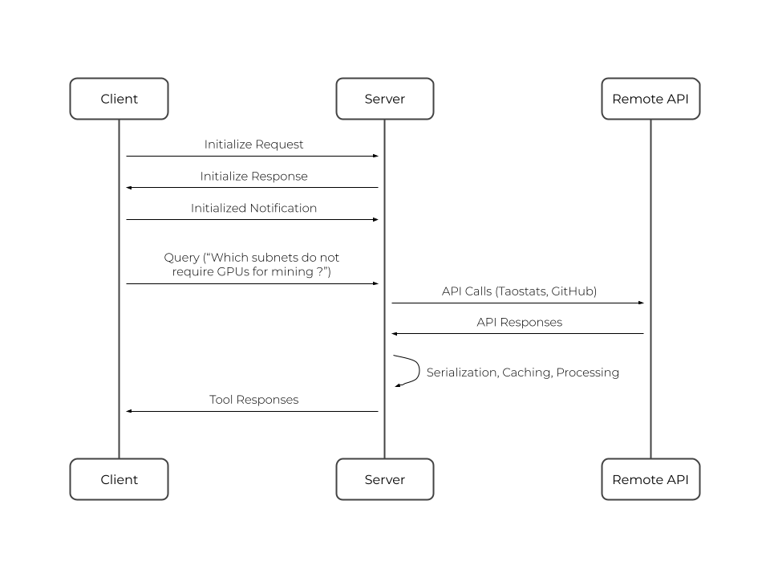

# Model Context Protocol Specification

## Protocol Overview

The **Bittensor Subnet Explorer** provides comprehensive technical insights into the diverse and evolving Bittensor subnet ecosystem, enabling users to make informed decisions through detailed technical documentation and comparative analysis.

By implementing the Model Context Protocol, this explorer can seamlessly integrate with your preferred LLM, enhancing its capabilities with real-time data from Taostats and GitHub APIs.

While tools such as the Taostats dashboard offer economic and performance metrics, the Bittensor Subnet Explorer allows for unique in-depth technical comparisons between subnets, including architecture differences, implementation requirements, and protocol specifications.

### Key benefits

These technical insights deliver significant advantages to key stakeholders in the Bittensor network:

**Miners & Validators**: Access detailed node requirements, hardware specifications, and operational parameters across all subnets to optimize deployment strategies and resource allocation.

**Developers**: Discover and leverage innovative projects within the Bittensor ecosystem, with streamlined access to technical documentation, implementation details, and architectural patterns across different subnets.

## Core Components

The Bittensor Subnet Explorer is implemented using the Kotlin SDK - a choice that balances performance, reliability, and developer productivity.

The server follows Clean Architecture principles to ensure maintainability, testability, and separation of concerns. This approach creates clear boundaries between system layers while keeping the domain logic independent of external frameworks and libraries.

```
src/
├── main/kotlin/
│   ├── application/              # Application Layer
│   │   ├── logging/                # Logging Utilities
│   │   └── server/                 # MCP Server Implementation
│   ├── data/                     # Data Layer
│   │   ├── cache/                  # Caching Utilities
│   │   ├── model/                  # External Models
│   │   ├── network/                # Remote data source access 
│   │   ├── repository/             # Data access contract implementation
│   │   └── util/                   # Data access utilities
│   ├── di/                       # Dependency Injection
│   ├── domain/                   # Domain Layer (Core Business Logic)
│   │   ├── entity/                 # Domain entities
│   │   ├── repository/             # Data access contract abstraction
│   │   └── service/                # Business Logic
├── test/kotlin/                  # Test Suite
│   ├── ...     
│   ...                         
```

The four main architectural layers are:

#### 1. Application Layer
    
Serving as the entry point for the Model Context Protocol integration, this layer is responsible for the configuration of the server features. It contains the request handlers, response formatters, and the core MCP server implementation that exposes the subnet explorer functionality to LLMs.

#### 2. Data Layer

   This layer implements the repository interfaces defined in the domain layer and handles all external data interactions. It contains API clients for Taostats and GitHub, data mapping logic, and caching mechanisms to optimize performance and reduce external API calls.

#### 3. Dependency Injection Layer

   This cross-cutting layer manages object creation and dependency resolution throughout the application. By implementing a custom dependency container, the codebase achieves loose coupling between components, simplified testing through dependency substitution, and centralized configuration management. This approach allows each component to focus on its core responsibility without concerning itself with the instantiation of its dependencies.

#### 4. Domain Layer

   The core business logic resides here, completely isolated from external dependencies. This layer contains the subnet entity models and business rules that define how the Bittensor subnet data should be handled and presented.
    

## Interfaces

### Client-Server Communication Protocols

The Bittensor Subnet Explorer supports two primary communication protocols for client interaction:

#### 1. Standard I/O Communication

   The server implements a bidirectional Standard I/O protocol that allows for synchronous request-response patterns. This interface is particularly well-suited for command-line interactions and script-based integrations with LLMs, providing a lightweight and universal access method.

#### 2. Server-Sent Events (SSE)

   For scenarios requiring remote communication, the server also supports HTTP with Server-Sent Events (SSE) transport. This implementation uses HTTP POST requests for client-to-server messages and SSE for server-to-client communication.

### Tool Definitions

The Bittensor Subnet Explorer exposes two tools:

- `get_subnet_list`: Returns a comprehensive catalog of available Bittensor subnets
- `get_subnet_documentation`: Retrieves detailed technical documentation for a specified subnet

All tools adhere to the MCP JSON Schema format with proper typing and validation for message exchanges :

- `jsonrpc`: Always set to "2.0" to identify the protocol version
- `id`: A unique identifier for request-response correlation
- `method`: Specifies the requested operation (for requests and notifications)
- `params`: Contains the parameters for the operation (for requests and notifications)
- `result`: Contains the operation result (for successful responses)
- `error`: Contains error information (for failed responses)


### External API Integration

The server integrates with external data sources while maintaining a clean separation between the MCP interface and these backend services:

#### 1. Taostats API Integration:
   - Provides subnet identity information
   - Uses paginated requests to efficiently retrieve subnet data at scale
   - Implements proper error handling and caching

#### 2. GitHub API Integration:
   - Retrieves technical documentation in the READMEs
   - Caches responses to reduce API calls and improve performance

These integrations are abstracted behind domain interfaces, allowing the MCP server to communicate with clients without exposing the underlying implementation details of these external services.

> **Note**: The server requires authentication credentials for both external APIs (Taostats API key and GitHub personal access token). These credentials must be provided during server initialization through environment variables.

### Logging Interface

To maintain a clean separation from the protocol communication channel (stdout), the server directs all logging output to System.err. This implementation ensures diagnostic information doesn't interfere with message exchange while providing comprehensive visibility into server operations.

### Error Handling

The interface implements comprehensive error reporting with appropriate HTTP status codes and detailed error messages to facilitate debugging and provide meaningful feedback to clients.

## Data Flow

The Bittensor Subnet Explorer implements a structured data flow following clean architecture principles, ensuring separation of concerns and maintainability. This section outlines how data moves through the system when handling client requests.



### Request Processing Flow

#### 1. MCP Request Reception
- The client sends a request via the configured transport layer (Stdio or SSE)
- The `McpServer` receives the JSON-RPC 2.0 formatted request
- The request is parsed and validated according to the MCP specification

#### 2. Domain Request Mapping
- The parsed request is mapped to a domain-specific operation (either subnet listing or documentation retrieval)
- Request parameters are validated
- The appropriate domain service is invoked from the application layer

#### 3. Repository Interaction
The flow diverges based on the requested operation:

#### For `get_subnet_list`:
- The domain layer calls the `SubnetRepository` interface
- The repository implementation fetches subnet identities from Taostats API
- Cached results are returned if available and valid according to cache policy
- If cache miss occurs, the repository makes an API call to Taostats
- The response is mapped to domain `SubnetInfo` entity
- Results are stored in cache before being returned

#### For `get_subnet_documentation`:
- The domain layer calls the `SubnetRepository` interface with a specific subnet ID
- The repository first verifies subnet existence via Taostats API
- If verified, the `GitHubRepoRepository` returns the cached documentation
- If cache miss occurs, the repository queries GitHub API for the subnet's technical documentation
- Documentation is parsed and structured according to domain requirements
- Results are cached to minimize external API calls before being returned

#### 4. Response Formation
- Domain objects are mapped back to MCP response format
- The response is serialized as a JSON-RPC 2.0 message
- The response is sent back to the client through the transport layer

#### Caching Strategy

The server implements a caching mechanism to optimize performance and reduce load on external APIs:

- **In-Memory Cache**: Stores frequently accessed data with configurable TTL
- **Cache Policy**: Standardizes data access among caches and allows for different expiration policies according to the data types
- **Cache Invalidation**: Automatic expiration based on TTL, with optional manual invalidation

#### Error Handling Flow

When errors occur at any stage of processing:

1. The error is caught and mapped to an appropriate domain exception
2. Domain exceptions are translated to MCP-compliant error codes and messages
3. Error responses follow the JSON-RPC 2.0 format with detailed information
4. Errors are logged through the separated logging channel (System.err)

This clean architecture approach ensures that business logic remains isolated from external dependencies, making the system more testable, maintainable, and adaptable to future changes.

## Context Management

The Bittensor Subnet Explorer implements a lightweight context management approach optimized for performance and reliability:

### In-Memory State

The server maintains all operational state in memory during runtime. This includes:

- (SSE Transport only) Active client connections and their associated metadata
- Request tracking information for correlating requests with responses
- Configuration settings loaded at startup

### Caching Layer

The primary persistent context is handled through the caching mechanism:

- **Cache Implementation**: In-memory caches stores subnet information and documentation
- **Cache Policies**: Configurable time-to-live (TTL) settings determine data freshness

This lightweight approach to context management enables the server to operate efficiently with minimal overhead, while the caching layer provides sufficient performance optimization by reducing redundant external API calls.

## Integration Guidelines

#### 1. Prerequisites :

 * Java 17 or later
 * Gradle (Gradle wrapper provided with the project) - only for local build
 * `Taostats` and `GitHub` API keys

#### 2. Transport mechanism :

 * **STDIO:** (Default) For locally deployed servers, communicates efficiently via standard input/output with the client.
 * **SSE:** Recommended for scalability, communicates over the network via HTTP. Requires secure authentication and authorization.

#### 3. Configuration:

 * Example Client Configurations (STDIO):
   * **Cursor:** Add the server to `settings.json` under `mcpServers`:
      ```json
      {
        "Bittensor Subnet Explorer": {
        "command": "java",
        "args": [
          "-jar",
          "path/to/bittensor-subnet-explorer.jar"
        ],
        "env": {
          "TAOSTATS_API_KEY": "YOUR_TAOSTATS_KEY",
          "GITHUB_PERSONAL_ACCESS_TOKEN": "YOUR_GITHUB_ACCESS_TOKEN"
        }
       }
      }
      ```
   * **Claude Desktop:** Add the server to `claude_desktop_config.json` under `mcpServers`:
      ```json
      {
        "Bittensor Subnet Explorer": {
        "command": "java",
        "args": [
          "-jar",
          "path/to/bittensor-subnet-explorer.jar"
        ],
        "env": {
          "TAOSTATS_API_KEY": "YOUR_TAOSTATS_KEY",
          "GITHUB_PERSONAL_ACCESS_TOKEN": "YOUR_GITHUB_ACCESS_TOKEN"
        }
       }
      }
      ```
   * Replace `YOUR_TAOSTATS_KEY` and `YOUR_GITHUB_ACCESS_TOKEN` with your actual api credentials.

